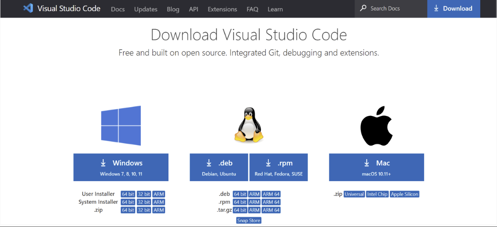

# **MLSA USM - Build Your First Data Science Web App using Streamlit**

> Are you interested in creating a web app that can predict whether someone would have survived the Titanic disaster? In this hands-on workshop, we'll show you how to do just that using Streamlit. First, we'll create a **classification model for Titanic survival prediction using logistic regression**. Then, we'll dive into **Streamlit** and learn how to **build an interactive web app** that can leverage this machine learning model. By the end of the workshop, you'll have a fully functional web app that you can share with your friends and family. Don't miss out on this opportunity to level up your data science skills!

---

## **How to Start?**

### **Software Installation**

These are the setup that you need to have for this workshop:

1. **GitHub Account**
2. **Git**
3. **Visual Studio Code**
4. **Python**

#### **GitHub**

1. go to [GitHub](https://github.com/)
2. go to Signup page 

3. enter your credential

4. Verify your account by answering the question.

5. Enter the launch code that has been sent to your email address.

6. Answer the questions according to your choice then click `continue`

7. Select the GitHub plan according to your choice. A free account is sufficient for you to attend this workshop.

Congratulations! Your GitHub account has been created successfully.

#### **Git**

> Refer to *installation folder* - **Software Setup Guideline for Introduction to Git Workshop.pdf**

#### Python

1. go to [Python Download](https://www.python.org/downloads/)

2. scroll down to look for a specific release and search for `python 3.9.10`.

>**For Mac OS users, you may refer to this [link](https://learn.microsoft.com/en-us/training/modules/python-install-vscode/3-exercise-install-python3?pivots=macos).** 

>**For Linux users, you may refer to this [link](https://learn.microsoft.com/en-us/training/modules/python-install-vscode/3-exercise-install-python3?pivots=linux).**   

3. Now scroll down to the Files section and look for the Windows x86-64 executable installer and download it. 

4. After downloading successfully, click on the downloaded file and click Install Now. 

5. The installation is done.

#### **Verifying Python is installed in Windows**

> To ensure if Python is successfully installed on the system. Follow the given steps: 
>
>Open the command prompt 
>
>Type ‘python’ and press enter. 
>
>The version of the python which you have installed will be displayed if the python is successfully installed on your windows. 

> Now we need to verify Pip is installed in Windows.  
>(Pip is a powerful package management system for Python software packages.) 
>
>To ensure if pip is successfully installed on the system. Follow the given steps: 
>
>Open the command prompt 
>
>Enter ‘pip -V’ to check if pip is installed. 
>
>The following output appears if pip is installed successfully.

Congratulations, you have successfully installed Python and pip on your Windows system. 

#### Visual Studio Code

1. go to [Visual Studio Code Download](https://code.visualstudio.com/Download)
> Mac OS user refer this [link](https://www.youtube.com/watch?v=P8ueOjodgkA)

> Linux user refer this [link](https://linuxize.com/post/how-to-install-visual-studio-code-on-ubuntu-20-04/)

2.Click the first option **Windows** to download VS Code.  

3.Double click the downloaded file. A dialogue box will appear. Select I accept the agreement > select Next. 

4. Select a folder by clicking Browse or just follow the default path > select Next.

5. Select Create a desktop icon so that it can be accessed from desktop > select the other options as per your need by clicking in the checkbox > select Next. 

6. Select Install. 

7. Select Finish to exit Setup > check in the check box to launch VS Code right now. 

#### Install Python Extension for Visual Studio Code 

1. In Visual Studio Code, from the menu bar select View > Extensions to open the Extensions view.

2. Enter `python` in the search box at the top of the Extensions view. 

3. Select the 'Python' extension published by Microsoft (described as IntelliSense (Pylance) and usually the first one in the list). The details about that extension appear in a tabbed panel on the right. In the either Extensions panel, or in the main panel, select `Install`. 

Congratulations! You have successfully installed the Python extension for Visual Studio Code. 

## How to clone this program

1. Open your command prompt
2. run `cd /d D:`
3. run `git clone https://github.com/shaunliew/MLSA_Data_Science_Web_App_Streamlit.git`
4. Open `MLSA_DataScience_Web_App_Streamlit` folder using VSCode.
5. Open terminal in VSCode
6. create virtual env `python3.10 -m venv venv`
7. Activate virtual env `d:/MLSA_Data_Science_Web_App_Streamlit/venv/Scripts/Activate.ps1`
8. run `pip install -r requirements.txt`

Now you are good to go for this workshop. See you in the workshop.

## Features used

>   1. Pclass - Ticket Class [1st = Upper,2nd = Middle,3rd = Lower ]
>   2. sex - Sex [male - 0, female - 1]
>   3. Age - Age
>   4. sibsp - number of siblings/spouses aboard the Titanic
>   5. parch - number of parents/children aboard the Titanic
>   6. embarked - Port of Embarkation (C = Cherbourg - 0, Q = Queenstown - 1, S = Southampton - 2)

## Test inputs

### First passenger : A

>1. Name : A
>2. Pclass : 3rd class
>3. sex : Female
>4. Age : 22
>5. sibsp : 1
>6. parch : 1
>7. embarked : Southampton

What is the *prediction result*?

### Second passenger : B

>1. Name : B
>2. Pclass : 3rd class
>3. sex : Male
>4. Age : 14
>5. sibsp : 0
>6. parch : 0
>7. embarked : Southampton

What is the *prediction result*?

---

## Thank you for joining this workshop

Feel free to contact me if you have any further questions.

Email: Shaun.Liew@studentambassdaors.com

This workshop is prepared by [*Shaun Liew*](https://www.linkedin.com/in/shaunliew20/) from:

[Beta Microsoft Learn Student Ambassador from Universiti Sains Malaysia](https://www.facebook.com/MicrosoftLearnStudentAmbassadors.USM)

---

References:

[The difference between linear regression and logistic regression linkedin post](https://www.linkedin.com/pulse/difference-between-linear-regression-logistic-shaun-liew/)

[Titanic Kaggle Dataset](https://www.kaggle.com/competitions/titanic/overview)

[streamlit installation](https://docs.streamlit.io/library/get-started/installation)

[streamlit reference](https://docs.streamlit.io/library/api-reference)

[FAQ](https://stackoverflow.com/questions/73095119/userwarning-x-does-not-have-valid-feature-names-but-logisticregression-was-fit)
